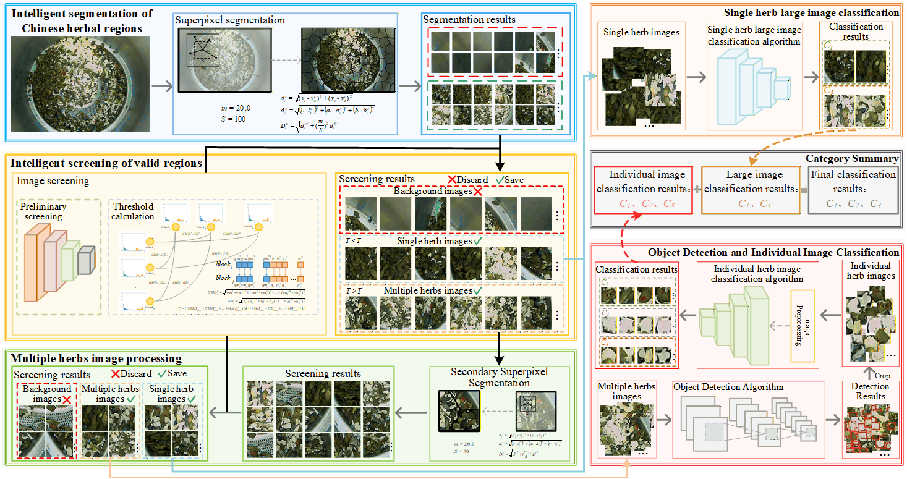

# CMHIVSD
The framework for CMHIVSD

## Usages
### Workflow Overview
1.  **`1-caijian-img-origin.py`**: Performs initial superpixel processing on herb container images to extract effective regions.
```
python 1-caijian_img_origin.py
``` 
2.  **`2-judge-yao-back-first.py`**: Classifies the initial superpixel segmentation results to filter out background regions.
```
python 2-judge_yao_back_first.py
``` 
3.  **`3-image-screening.py`**: Categorizes the herb images into two groups: **single-herb region images** and **multi-herb region images**.
```
python 3-image_screening.py
``` 
4.  **`4-caijian-img-second.py`**: Performs a second round of superpixel segmentation specifically on multi-herb images to further refine the effective regions.
```
python 4-caijian_img_second.py
``` 
5.  **`5-judge-yao-back-second.py`**: Classifies the secondary superpixel results to filter out background regions.
```
python 5-judge_yao_back_second.py
``` 
6.  **`6-image-screening-second.py`**: Further divides the secondary segmented regions into single-herb and multi-herb regions.
```
python 6-image_screening_second.py
``` 
7.  **`7-bigimg-classifiction.py`**: Performs final identification and classification on the confirmed single-herb region images.
```
python 7-bigimg_classifiction.py
``` 
8.  **`8-yolo-yao.py`**: Utilizes the YOLO model to detect and extract individual herb images from multi-herb region images.
```
python 8-yolo_yao.py
``` 
9.  **`9-create-csv-self-stitching.py`**: Implements a **self-stitching strategy** to process individual herb images.
```
python 9-create_csv_self_stitching.py
``` 
10. **`10-smallimg-classifiction-self-stitching.py`**: Classifies the synthesized images generated via the self-stitching strategy.
```
python 10-smallimg_classifiction_self_stitching.py
``` 
11. **`11-create-csv-random-stitching.py`**: Implements a **random-stitching strategy** to process individual herb images.
```
python 11-create_csv_random_stitching.py
``` 
12. **`12-smallimg-classifiction-random-stitching.py`**: Classifies the synthesized images generated via the random-stitching strategy.
```
python 12-smallimg_classifiction_random_stitching.py
```
### Model Weights
All trained model weights are intended to be stored in the `models` folder. Due to their large file size, they are hosted on **Baidu Netdisk** for easy access.


The trained models have been uploaded to Baidu Netdisk, and the link is provided below.


Files shared via cloud drive: CMHIVSD_models  


Link: https://pan.baidu.com/s/1v2puW6JcYDgrBzI8Wr2zsw Extraction code: CMHI
